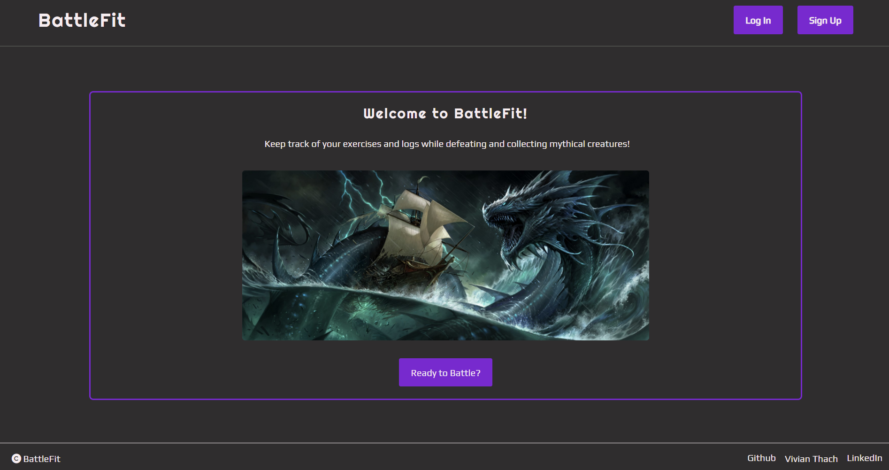
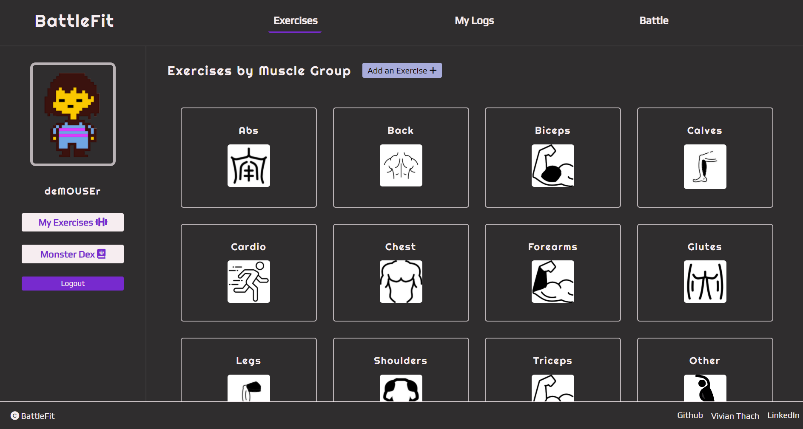
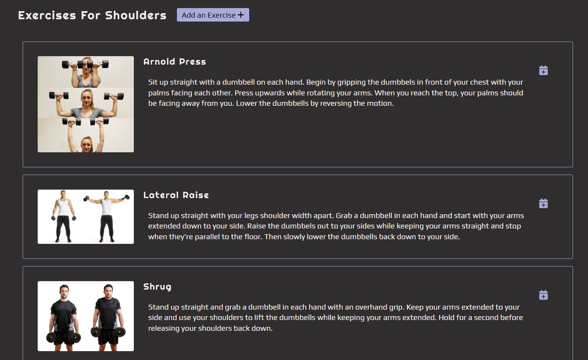
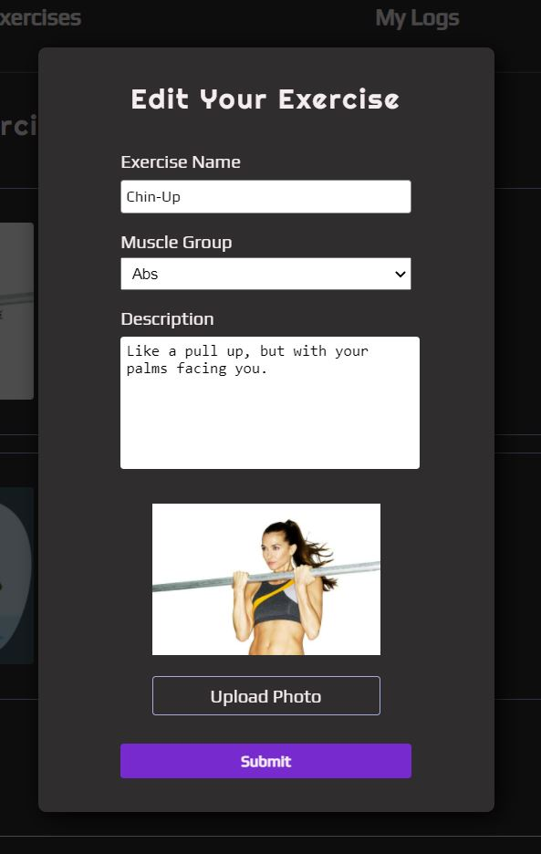
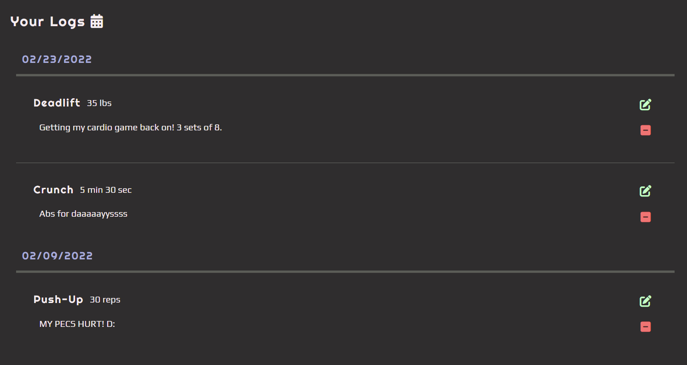
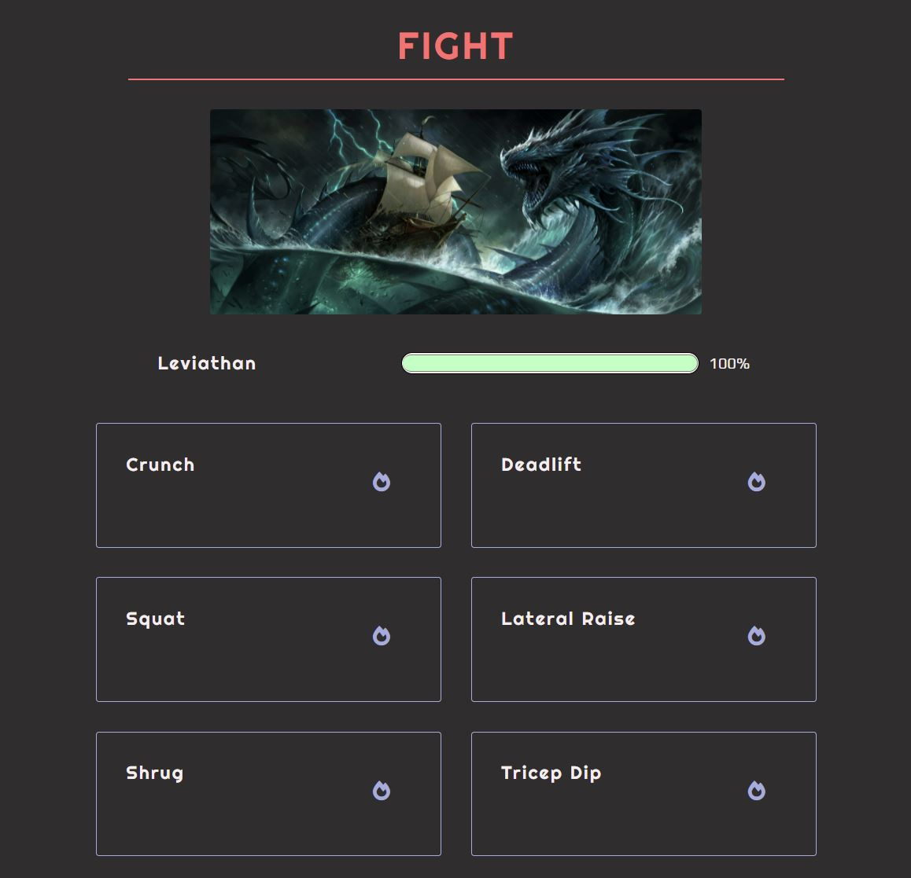
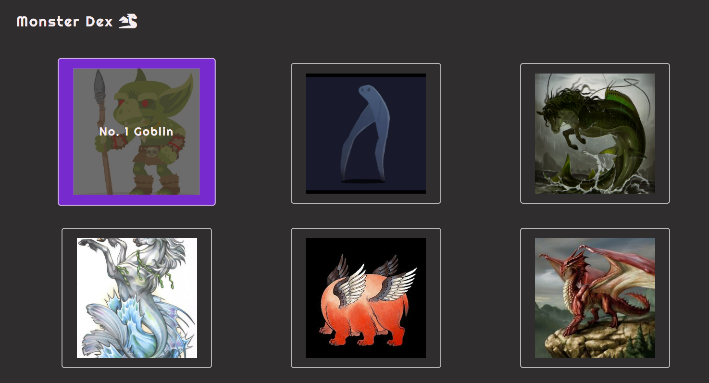
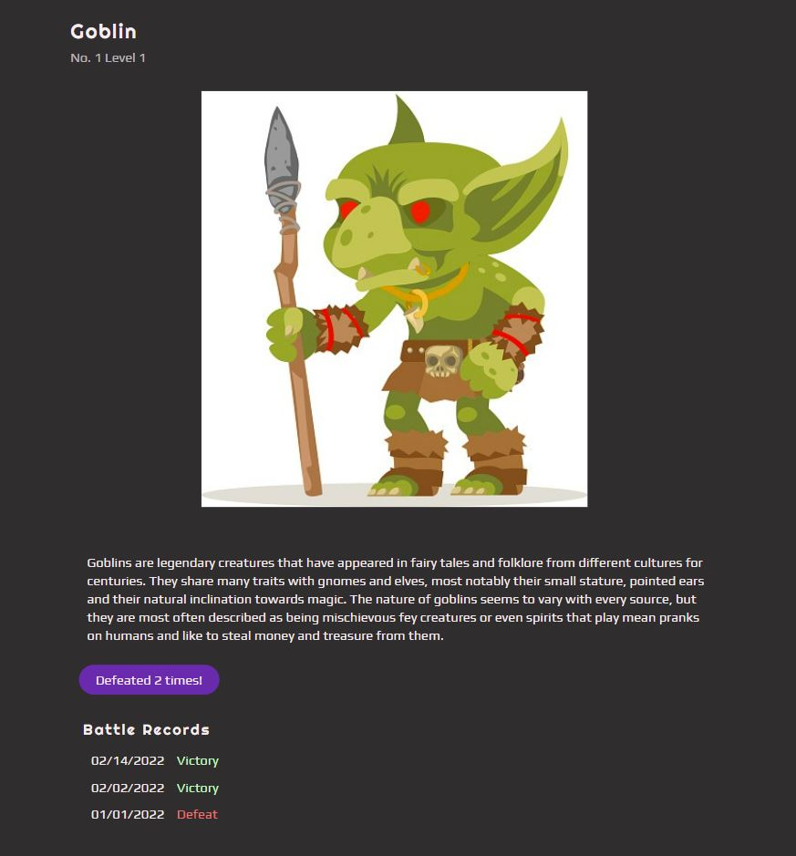

# BattleFit

BattleFit is a gamified workout tracker to motivate people to stay fit. Users to create custom exercises, keep logs of the exercises they've done and use these exercises to battle and collect monsters. This application is inspired by Habitica, WorkIt, and Pokemon.

[See the site live here!](https://the-battle-fit.herokuapp.com/)

* [MVP Feature List Document](https://github.com/bobaguardian/battlefit/wiki/MVP-Feature-List)
* [User Stories](https://github.com/bobaguardian/battlefit/wiki/User-Stories)
* [Database Schema](https://github.com/bobaguardian/battlefit/wiki/Database-Schema)
* [Frontend Routes](https://github.com/bobaguardian/battlefit/wiki/Frontend-Routes)
* [API Documentation](https://github.com/bobaguardian/battlefit/wiki/API-Documentation)

## Technologies Used
BattleFit is built on a React frontend with a Flask backend using PostgreSQL as a database. It utilizes React libraries for all the display logic and Redux with thunks making API calls to the backend server to manage the state. The backend uses the Flask framework and a PostgreSQL database.  SQLAlchemy is the ORM used to handle all data manipulation of the database.  Image uploading on BattleFit is implemented through Amazon Web Services S3.

             
 
 ## Getting started
1. Clone this repository

   ```git@github.com:bobaguardian/battlefit.git```

2. CD into the /app directory and install dependencies

    ```pipenv install```

3. CD into the /react-app directory and install dependencies

    ```npm install```

4.  Create a .env file based on the .env.example given (An AWS S3 account is required for adding/editing user and exercise images!)

5.  Create a user in psql based on your .env DATABASE_URL app_name

    ```psql -c "CREATE USER <username> PASSWORD '<password>' CREATEDB"```

6.  Create a databse in psql based on your.env DATABASE_URL app_db_name

7. Start your shell, migrate your database, seed your database, and run the flask app

   ```pipenv shell```

   ```flask db upgrade```

    ```flask seed all```

    ```flask run```

8. Open another terminal and change directory into /react-app and run the React app

	```npm start```

#### Awesome! Now you can navigate to http://localhost:3000 and use the application!


## Features

### Splash Page

The splash page features a image slideshow of a few monsters you can battle when using the application.  Users can log into an existing account or sign up to create a new account.  There is also a demo option so users can easily check out the site.




### Dashboard

Once logged in, the user is redirected to their dashboard showing their information on the left side panel and a grid of muscle groups that users can click on to browse exercises on the site.  Users can also add an exercise of their own from this page and any exercise related page.



### Exercises
Upon clicking on a muscle group from the dashboard, the user can see a list of exercises for that muscle group.  The calendar icon on the right side of an exercise allows users to add a log for that exercise.  The layout is identical to the My Exercises (on the side panel) page looks like, but with the user's created exercises instead.



### Form Modals
All forms appear in the form of modals.  Here is an example of a form modal to edit an existing exercise the user has created.  Image uploading and submission is implemented using Amazon Web Services S3.



### Logs
On the My Logs tab, the user can see the logs they have created including its details and comments.  The logs are ordered by date with the most recent showing at the top.  The user can also edit or delete their logs with the green and red icons on the log box.



### Battles
Users can participate in exciting battles with a random monster from a list of 55 seeded monsters!  Each monster has a level difficulty which dictates the amount of exercises that need to be logged.  Users can "damage" monsters by submitting a log for that exercise by clicking the fire icon.  Upon completing an exercise, there is a dynamic health bar that decreases.  There is no measurement converter based on how many reps or how long the user did an exercise because every user exercises at their own pace!  It's an honor system, so battle with honor!



### Monster Dex
Users can collect the monsters that they have encountered in battles.  Monsters are layed out in a grid like fashion, with their number and name appearing on hover of each monster box.  Clicking on a monster here will redirect the user to that monster's detail page.  This page displays more details on the monster as well as the user's battle records with that monster.  Not all of the monsters are displayed in the monster dex right away, but that's the fun part!  Keep exercising and battling monsters to collect more!





## Future Implementations

* Implement a calendar system into logs
* Add search functionality for exercises
* Add filtering functionality for the monster dex

<!-- ## Redux Store Tree -->
